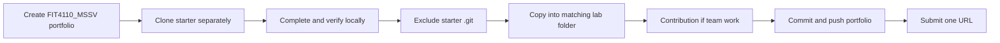
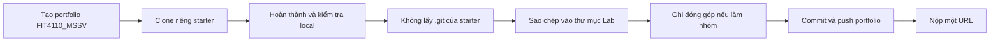

# Course workflow

Create your portfolio before Lab 01. This makes its commit history and generated `git-log.txt` your own work history rather than the starter repository's history.

## At the start of the semester

1. Create one public GitHub repository named `FIT4110_<MãSinhViên>` and select **Add a README file**. The README creates the first commit needed by Lab 01 evidence.
2. Clone that repository locally. Create each lab folder when you begin that lab: `01_Setup/`, `02_OpenAPI/`, `03_Postman/`, `04_Docker/`, `05_Compose/`, or `06_Plugathon/`.
3. From this point onward, your portfolio is the only repository you push for this course.

## For every lab

1. Clone the stated public starter into a separate temporary working folder. Do not edit the source repository on GitHub.
2. Complete the lab and run its required commands locally from that working copy.
3. Copy the completed contents into the matching portfolio folder while excluding the starter's `.git` directory.
4. Do not place a Git repository inside another Git repository. Source `.github/workflows/` files are written for the starter repository root; when copied under a lab folder they do not run and must not be used as completion evidence.
5. Run the lab's lint, test, build, and health checks locally. Store the resulting reports, screenshots, and known issues in that lab folder.
6. When an artefact is shared by a team, copy the agreed version into every relevant personal portfolio and add `CONTRIBUTION.md` using the [team contribution template](../04_Templates/team-contribution-template.md).
7. Commit and push after each lab. Submit the same portfolio URL through the course submission channel when instructed.

> **Lab 01 is different:** create `01_Setup/`, copy the starter into it without the starter's `.git`, and then run the evidence scripts from `01_Setup/`. Never delete or replace `<portfolio>/.git`; it is the Git history of your personal portfolio.

After a lab's submission deadline, do not rewrite its Git history or silently replace its artefacts. Record any correction in a new commit and explain it in the affected lab's `CONTRIBUTION.md` or `known-issues.md`.

---

## Bản tiếng Việt

# Quy trình học phần

Tạo portfolio trước Lab 01. Việc này giúp commit history và `git-log.txt` được sinh ra phản ánh lịch sử làm bài của chính sinh viên, thay vì lịch sử của starter repository.

## Đầu học kỳ

1. Tạo một GitHub repository public tên `FIT4110_<MãSinhViên>` và chọn **Add a README file**. README tạo commit đầu tiên cần cho minh chứng Lab 01.
2. Clone repository này về máy. Tạo thư mục khi bắt đầu Lab tương ứng: `01_Setup/`, `02_OpenAPI/`, `03_Postman/`, `04_Docker/`, `05_Compose/` hoặc `06_Plugathon/`.
3. Từ thời điểm này, portfolio là repository duy nhất sinh viên push cho học phần.

## Với mỗi Lab

1. Clone starter công khai của Lab vào một thư mục làm việc tạm riêng. Không chỉnh sửa source repository trên GitHub.
2. Hoàn thành Lab và chạy các lệnh bắt buộc ở local từ working copy đó.
3. Sao chép nội dung đã hoàn thành vào thư mục Lab tương ứng trong portfolio nhưng không lấy thư mục `.git` của starter.
4. Không đặt một Git repository bên trong Git repository khác. Các file `.github/workflows/` của starter được viết cho root của starter; khi nằm dưới thư mục Lab, chúng không chạy và không được dùng làm minh chứng hoàn thành.
5. Chạy lint, test, build và health check của Lab tại local. Lưu report, ảnh chụp và known issues vào thư mục Lab đó.
6. Khi artefact là kết quả chung của nhóm, sao chép bản đã thống nhất vào mọi portfolio cá nhân liên quan và thêm `CONTRIBUTION.md` theo [team contribution template](../04_Templates/team-contribution-template.md).
7. Commit và push sau mỗi Lab. Nộp cùng một URL portfolio theo kênh nộp bài của học phần khi được yêu cầu.

> **Lab 01 làm khác:** tạo `01_Setup/`, sao chép starter vào đó mà không lấy `.git` của starter, rồi chạy evidence scripts từ `01_Setup/`. Tuyệt đối không xoá hoặc thay thế `<portfolio>/.git`; đây là Git history của portfolio cá nhân.

Sau mốc nộp của một Lab, không rewrite Git history hoặc âm thầm thay artefact của Lab đó. Mọi sửa đổi phải có commit mới và được giải thích trong `CONTRIBUTION.md` hoặc `known-issues.md` của Lab liên quan.
