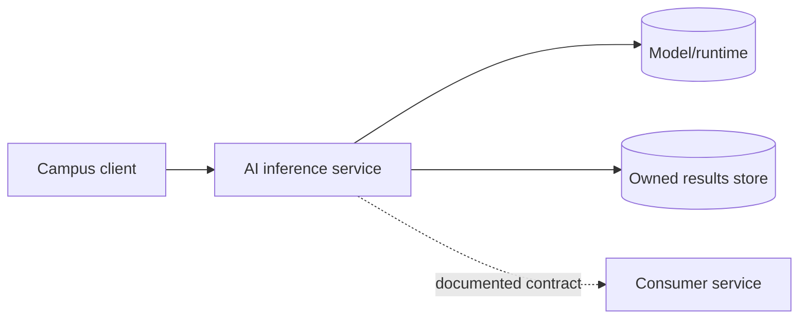

# Session 1 — Service boundary

## Why boundaries come first

AI systems fail in integration when nobody agrees on ownership: who validates input, who stores data, who predicts, and who handles failure. A service boundary makes those decisions visible before code makes them expensive to change.

Start with [the Service Boundary template](../04_Templates/service-boundary-template.md). Identify actors, owned responsibilities, excluded responsibilities, inputs/outputs, dependencies, and failure paths. A useful boundary can be explained in one diagram and tested through one contract.

Complete the template before Lab 02. “The whole Smart Campus system” is not a service boundary; name only the capability your team owns.

---

# Bản dịch tiếng Việt

## Vì sao boundary phải có trước?

Hệ thống AI dễ gặp lỗi tích hợp khi không ai thống nhất trách nhiệm: ai kiểm tra input, ai lưu dữ liệu, ai suy luận và ai xử lý lỗi. Ranh giới service giúp quyết định này rõ ràng trước khi code khiến thay đổi trở nên tốn kém.

Bắt đầu bằng Service Boundary template. Xác định actor, trách nhiệm thuộc nhóm, trách nhiệm loại trừ, input/output, dependency và đường đi khi lỗi. Một boundary tốt cần giải thích được bằng một sơ đồ và kiểm thử qua một contract. Hoàn thành template trước Lab 02; toàn bộ Smart Campus không phải một service boundary—chỉ nêu capability nhóm bạn sở hữu.
