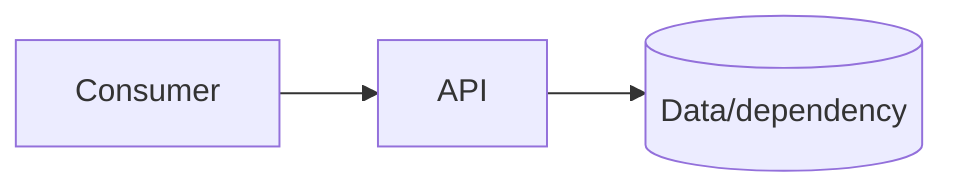
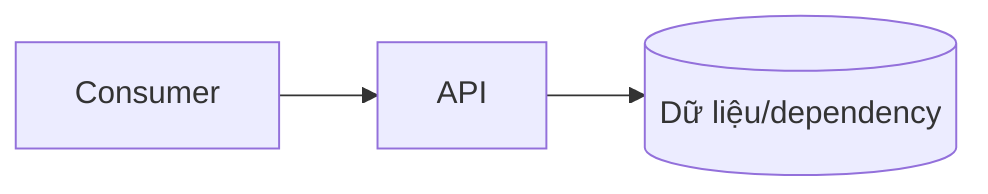

# `<service-name>`

## Purpose

What user/problem does this service solve? What is deliberately outside scope?

## Team information

- Team:
- Service/capability:
- Role: Provider / Consumer / Both
- Members:
- Shared artefacts used in this lab:

## Individual contribution

- Work completed:
- Files or sections owned:
- Tests run:
- Issues resolved or remaining:

## Architecture



## Run from a clean clone

```bash
cp .env.example .env
docker compose up -d --build
curl http://localhost:8000/health
```

## Contract and testing

- Contract:
- Test command:
- Expected report:
- Known limitations: `known-issues.md`

## Evidence

List the evidence directory and the relevant report or screenshot paths.

---

## Bản tiếng Việt

# `<tên-service>`

## Mục đích

Service này giải quyết người dùng/vấn đề nào? Điều gì được chủ động loại khỏi phạm vi?

## Thông tin nhóm

- Nhóm:
- Service/capability:
- Vai trò: Provider / Consumer / Cả hai
- Thành viên:
- Artefact chung dùng trong Lab này:

## Đóng góp cá nhân

- Công việc đã hoàn thành:
- File hoặc phần phụ trách:
- Kiểm thử đã chạy:
- Vấn đề đã xử lý hoặc còn tồn tại:

## Kiến trúc



## Chạy từ clone sạch

```bash
cp .env.example .env
docker compose up -d --build
curl http://localhost:8000/health
```

## Contract và kiểm thử

- Contract:
- Lệnh test:
- Report dự kiến:
- Giới hạn đã biết: `known-issues.md`

## Minh chứng

Liệt kê thư mục minh chứng và đường dẫn report hoặc ảnh chụp liên quan.
