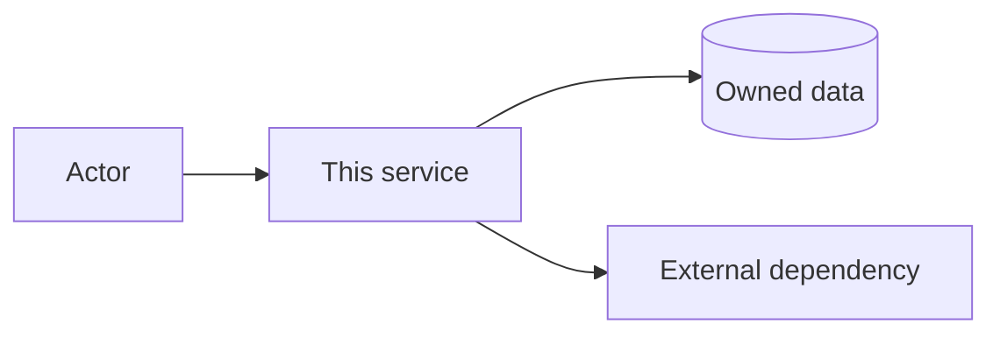

# Service boundary — `<service-name>`

## Context and ownership

- Team / members:
- Service owner:
- Problem solved for whom:
- In scope (we own):
- Out of scope (integrated or explicitly excluded):

## Actors, inputs, outputs

| Actor/service | Sends | Receives | Contract / channel |
|---|---|---|---|
|  |  |  |  |

## Bản dịch tiếng Việt

Ghi nhóm, owner, vấn đề, phạm vi sở hữu/loại trừ, actor, input/output, trách nhiệm khi lỗi, dữ liệu, dependency, API dự kiến và các quyết định còn mở.

## Responsibilities and failure behavior

- The service must:
- The service must not:
- Validation and error responsibility:
- Data owned / retained:
- Dependencies and degraded-mode behavior:

## Candidate API

| Method/event | Path/topic | Purpose | Consumer |
|---|---|---|---|
| GET | `/health` | readiness/health | operations |

## Decisions and open questions

| Decision/question | Owner | Due date | Status |
|---|---|---|---|
|  |  |  |  |
