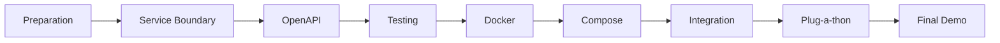
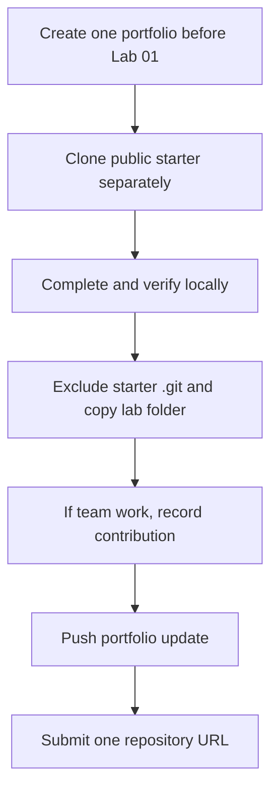
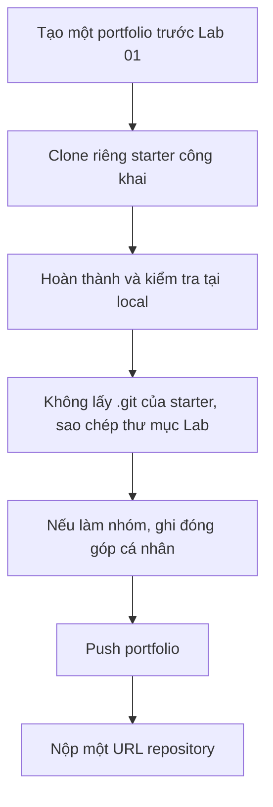

# FIT4110 — Student Kit

Official, semester-long guide for **FIT4110 – Dịch vụ kết nối & Công nghệ nền tảng**. This kit is the course map, not a replacement for the lab repositories. For technical tasks, artefacts, and lab-specific completion criteria, the linked TrangLe1912 repository is authoritative; this Kit intentionally changes only the submission workflow.

## Why this matters for CS / AI students

An accurate model, notebook, or data pipeline is not yet a product. A production team needs a clear boundary, a stable API contract, tests, a portable runtime, and a way to run dependent services together. FIT4110 teaches the engineering bridge from AI/data/software work to an operable service.

## Quick start

1. Create one public portfolio repository named `FIT4110_<MãSinhViên>`, select **Add a README file**, and clone it locally **before Lab 01**.
2. Read [Session 0](01_Getting_Started/SESSION0_Preparation.md) and follow [the course workflow](01_Getting_Started/COURSE_WORKFLOW.md).
3. Clone each public lab starter separately, then copy its completed contents into the matching portfolio folder without the starter's `.git` directory.
4. Keep every lab in its own folder and submit the same portfolio URL through the course submission channel.

> **Lab 01 exception:** copy the starter into `01_Setup/` first, then run its evidence scripts from that folder so `git-log.txt` records your portfolio history. Never delete the `.git` directory at the root of `FIT4110_<MãSinhViên>`.

## Lab ecosystem

| Stage | Use this public source repository | Student outcome |
|---|---|---|
| Lab 01 | [FIT4110_setup](https://github.com/TrangLe1912/FIT4110_setup) | environment evidence + service boundary |
| Lab 02 | [FIT4110_lab02_openapi](https://github.com/TrangLe1912/FIT4110_lab02_openapi) | REST OpenAPI or preliminary event contract + negotiation record |
| Lab 03 | [FIT4110_lab03_postman_mock_testing](https://github.com/TrangLe1912/FIT4110_lab03_postman_mock_testing) | Postman tests, mock, Newman report |
| Lab 04 | [FIT4110_lab04_docker_packaging](https://github.com/TrangLe1912/FIT4110_lab04_docker_packaging) | Dockerfile, runnable image, evidence |
| Lab 05 | [FIT4110_lab05_docker_compose](https://github.com/TrangLe1912/FIT4110_lab05_docker_compose) | completed dependency-aware Compose stack |
| Lab 06 | No separate public starter currently listed | integration handshake + Plug-a-thon evidence |

## Submission in one view

Read [Git Guide](03_Guides/Git_Guide.md) and [Submission](03_Guides/Submission.md) for exact commands.

## Navigation

- [Getting started](01_Getting_Started/LEARNING_MAP.md)
- [Lab guides](02_Labs/)
- [Guides and troubleshooting](03_Guides/)
- [Student templates](04_Templates/)
- [Team artefact and contribution template](04_Templates/team-contribution-template.md)
- [Assessment and demo pack](05_Assessment/)
- [FAQ](03_Guides/FAQ.md)

## Course principle

**Contract is the shared promise; artefacts are the evidence.** Make every submission reproducible from a clean clone.

---

# Bản dịch tiếng Việt

## Tổng quan học phần

Đây là bộ hướng dẫn chính thức cho **FIT4110 – Dịch vụ kết nối & Công nghệ nền tảng**. Student Kit là bản đồ học phần; các repository Lab công khai của TrangLe1912 là nguồn chính thức cho nhiệm vụ kỹ thuật, artefact và tiêu chí riêng của từng bài. Kit này chỉ chủ động thay đổi quy trình nộp bài. Mục tiêu là tạo ra bài làm có thể chạy lại và tích hợp được.

## Vì sao sinh viên Khoa học máy tính / AI cần học nội dung này?

Một mô hình chính xác, notebook hoặc pipeline dữ liệu chưa phải là sản phẩm. Để vận hành trong thực tế, nhóm cần ranh giới trách nhiệm rõ ràng, API ổn định, kiểm thử, môi trường chạy di động và cách khởi động các dịch vụ phụ thuộc. FIT4110 là cầu nối từ AI/dữ liệu/phần mềm sang dịch vụ có thể triển khai.

## Bắt đầu nhanh

1. Tạo một repository portfolio public tên `FIT4110_<MãSinhViên>`, chọn **Add a README file** và clone về máy **trước Lab 01**.
2. Đọc Session 0 và làm theo [quy trình học phần](01_Getting_Started/COURSE_WORKFLOW.md).
3. Clone riêng starter công khai của từng Lab, sau đó sao chép nội dung đã hoàn thành vào thư mục Lab tương ứng trong portfolio, không mang theo thư mục `.git` của starter.
4. Giữ mỗi Lab trong một thư mục riêng và nộp cùng một URL portfolio theo kênh nộp bài của học phần.

> **Ngoại lệ Lab 01:** sao chép starter vào `01_Setup/` trước, sau đó chạy evidence scripts từ thư mục này để `git-log.txt` ghi lịch sử portfolio. Tuyệt đối không xoá thư mục `.git` ở root của `FIT4110_<MãSinhViên>`.

## Hệ sinh thái Lab

| Giai đoạn | Repository nguồn công khai | Kết quả sinh viên |
|---|---|---|
| Lab 01 | [FIT4110_setup](https://github.com/TrangLe1912/FIT4110_setup) | minh chứng môi trường + service boundary |
| Lab 02 | [FIT4110_lab02_openapi](https://github.com/TrangLe1912/FIT4110_lab02_openapi) | REST OpenAPI hoặc event contract sơ bộ + negotiation record |
| Lab 03 | [FIT4110_lab03_postman_mock_testing](https://github.com/TrangLe1912/FIT4110_lab03_postman_mock_testing) | Postman test, mock, Newman report |
| Lab 04 | [FIT4110_lab04_docker_packaging](https://github.com/TrangLe1912/FIT4110_lab04_docker_packaging) | Dockerfile, image chạy được, minh chứng |
| Lab 05 | [FIT4110_lab05_docker_compose](https://github.com/TrangLe1912/FIT4110_lab05_docker_compose) | Compose stack hoàn chỉnh theo dependency của service |
| Lab 06 | Chưa có public starter riêng | integration handshake + Plug-a-thon evidence |

## Quy trình nộp bài

Đọc [Git Guide](03_Guides/Git_Guide.md) và [Submission](03_Guides/Submission.md) để xem lệnh và checklist chi tiết.

## Điều hướng

- [Bắt đầu học phần](01_Getting_Started/LEARNING_MAP.md)
- [Hướng dẫn Lab](02_Labs/)
- [Hướng dẫn và gỡ lỗi](03_Guides/)
- [Template sinh viên](04_Templates/)
- [Template artefact nhóm và đóng góp cá nhân](04_Templates/team-contribution-template.md)
- [Assessment và demo pack](05_Assessment/)
- [FAQ](03_Guides/FAQ.md)

## Nguyên tắc học phần

**Contract là cam kết chung; artefact là minh chứng.** Mọi bài làm phải chạy lại được từ một bản clone sạch.
